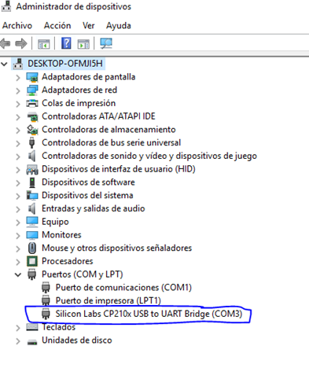
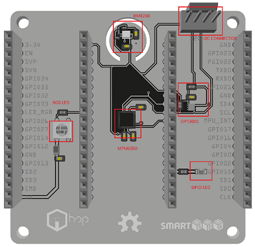
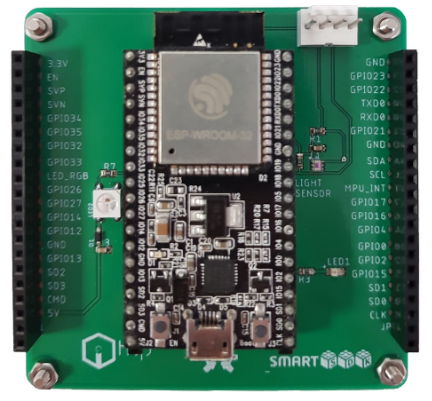
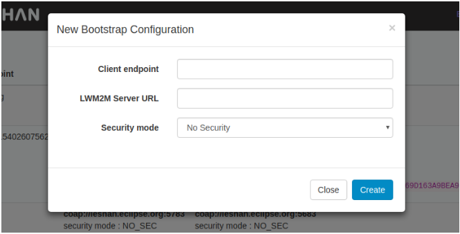

# User&#39;s guide for Smart Spot Starter Kit

## Introduction

In order to offer a simple and intuitive way to get started with our Smart Spot
we have developed an Open Source solution called Smart Spot Starter Kit, which
has an obvious educational purpose. Just by simply obtaining this kit and 
follow this guide you will be able to manage the device and to acquire data 
from its board sensors, apart from the ones you connect with your smartphone.

To achieve this, we take advantage from technologies like Physical Web. Users
interact via their smartphones thanks to our device that sends &quot;push&quot;
notifications with digital content through Bluetooth without the need to 
install native Apps.

In order to monitorize the air pollution, Smart Spot measures the NO2, CO, SO2
and O3 at specific points in real time. We have a sophisticated high precision
lab, with a Mass Flow Controller and a Zero Air Generator, where through 
Machine Learning algorithms we improve the precision of our sensor measures 
reducing the effect of cross sensitivity.

For the care and management of data collected by the Smart Spot a maintenance
platform is  needed, our device can be managed remotely by platforms which use
OMA LWM2M as FIWARE. We deploy FIWARE to manage Smart Spot data and also, we
integrate our solution in already existing FIWARE ecosystems.

Optionally, this system provides information about crowds in specific areas,
detecting people with smartphone WiFi switched-on.

## What do you need?

What is included with The Smart Spot Starter Kit:

   1. [ESP32 DevKitC](http://a.co/6nSNpvA):    
      
   2. Starter Kit firmware
      * Physical Web
      * Crowd Monitoring
      * LwM2M server
      * Integration with I2C sensor
      * GPIO driver
   3. [Expansion Board](http://www.hopu.eu/):  
      * Temperature, Humidity and Pressure Sensor.
      * Accelerometer and Gyroscope.
      * Luminosity Sensor
      * RGB led
      * GPIO Led
   4. Micro USB Cable
   5. [Smart Spot Air Quality Expansion Board](http://www.hopu.eu/)  
   6. I2C Cable (included with the expansion board)  
          
   7. 4 x [Gas Sensors](http://www.alphasense.com/index.php/air/):  
      * Sulfur Dioxide (Red).
      * Ozone + Nitrogen Dioxide (Yellow).
      * Carbon Monoxide (Green).
      * Nitrogen Dioxide (Orange).
      
       

## Getting Started 

## Device Configuration  

This chapter is a guide for Windows users. In case you use another OS, you can 
find further information in the following link:
[ESP-IDF](http://esp-idf.readthedocs.io/en/latest/get-started/index.html)

   1. First, you need to download the ESP32 toolchain by clicking in this link:
   [ESP32 toolchain](https://bit.ly/2js02AW). Unzip it and place somewhere safe.
   This guide assumes the environment is placed in  C:\ .

   2. You will also need the ESP32 API. In order to download it, open a
   terminal, navigate to a directory where you want to place the IDF and use
   these commands:   
   
      ~~~
      $ git clone --recursive https://github.com/espressif/esp-idf.git

      $ git checkout tags/v3.0-rc1

      $ git submodule update –init
      ~~~
   
      Every time you restart your PC you will need to define the IDF\ \_PATH by
      using this command:

      ~~~
      $ export IDF\_PATH=&quot;C:/msys32/home/user-name/esp/esp-idf&quot;
      ~~~ 

      In case you want to set the path permanently, check out this link:
      <https://bit.ly/2KxiunW>
      
   3. Now is time to download the Smart Sport Firmware. You should open a
      terminal in  another directory and clone our firmware by using the 
      following command:

      ~~~
      $ git clone –-https://github.com/HOP-Ubiquitous/SmartSpot\_SmartSDK\_Firmware.git
      ~~~

   4. Once you downloaded everything, open the ESP32 toolchain in order to 
      flash the  firmware. Go to the directory where you placed the 
      toolchain and execute the  file mingw32.
      
         

   5. Plug your ESP32 into your PC. Then go to Device Manager and look for its
      port number (i.e.: COM3).   
        
        
         
      You may have to download its driver in case you are not able to flash.
      Download it here.

        [USB to UART Bridge](https://bit.ly/2v0gwnS)

   6. It is time to flash the esp32. Open a Mingw32 terminal and copy the port
      and the directory of bootloader.bin, smartspot-esp32.bin, 
      partitions_singleapp.bin and esptool.py: 
      
      * **esptool.py directory** 
      * **Port** 
      * **Bootloader.bin directory** 
      * **smartspot-esp32.bin directory** 
      * **partitions_singleapp.bin directory**

      Replace them by the bolded words of the following command:
      
      ~~~
      $ python 
      /c/Users/HOPU/GitHub/espidf/components/esptool_py/esptool/esptool.py
      --chip esp32
      --port COMX --baud 115200 --before default_reset --after hard_reset 
      write_flash -z --flash_mode dio --flash_freq 40m --flash_size detect
      0x1000
      C:/Users/HOPU/GitHub/SmartSpot_SmartSDK_Firmware/bootloader.bin 0x10000
      C:/Users/HOPU/GitHub/SmartSpot_SmartSDK_Firmware/smartspot-esp32.bin
      0x8000
      C:/Users/HOPU/GitHub/SmartSpot_SmartSDK_Firmware/partitions_singleapp.bin 
      ~~~

      Copy then the whole command and use it for flashsing the esp32.
             
      

      A message like the one above should appear if you flashed the firmware successfully.

### Expansion board integration
   
   

This is a detailed list of the expansion board components:  

* **Bme280** : This well-known sensor from Bosch measures humidity with ±3% 
     accuracy, barometric pressure with ±1 hPa absolute accuracy, and
     temperature with ±1.0°C accuracy. It can be used either with SPI or I2C.

* **Mpu6050** : this sensor contains a MEMS accelerometer and a MEMS gyro in
  a single chip. It is very accurate, as it contains 16-bits analog to
  digital conversion hardware for each channel. Therefor it  captures the
  x, y, and z channel at the same time. The sensor uses the I2C-bus
  interface.

* **Opt3001** : is a sensor that measures the intensity of visible light. The
  spectral response of the sensor tightly matches the photopic response of
  the human eye and includes significant infrared rejection.

* **WS2812** : is an intelligent control LED light source that the control 
  circuit and RGB chip are integrated in a package of 5050 components. It
  internally includes digital port latch and reshaping amplification drive
  circuit. Each color has a different meaning, representing the current
  status of the Smart Spot:
    * Purple: Starting software.
    * Blue: Attaching to global connectivity.
    * Orange: Bootstrapping. Connecting to LwM2M servers.
    * Green: Device fully functional.
* **GPIO Led** : is just simply a Led controlled by a GPIO pin of the ESP32.
  You can manage and switch it on/off from the dashboard.

The expansion board is completely plug and play. If you previously flashed the 
ESP32 correctly you will only have to plug it in its mark.

   

### Gas Sensor Integration

The idea is to connect the Smart Spot Starter Kit with the gas sensors. Between
the available gases, we selected the most important to quantify the air quality
(gases required by the OMS), the most interesting depending of the use cases but
also interesting gases to carry out corrections in measures:

* NO2: Nitrogen dioxide

* SO2: Sulfur dioxide

* O3: Ozone

* CO: Carbon monoxide

   

In order to carry out the connection between the Expansion board and the Smart
Spot Air Quality Expansion Board you only have to plug the I2C cable to one of
the two I2C Smart Spot Connectors. Regarding I2C Gas connectors, the every port
must match its gas:

| Port | Gas                |
| ---- |:------------------:|
| J3   | NO2                |
| J4   | O3                 |
| J5   | CO                 |
| J6   | SO2                |
| J7   | Work in Progress   |
| J8   | Work in Progress   |

The Smart Spot LwM2M Client offers both a proprietary OMA LwM2M object called
*"SmartSpot Gas Concentration"* created specifically to provide information
related to interesting variables of the gas sensors, and on the other hand the
standard IPSO Alliance Concentration Object. Information and specification 
about this last one can be found in this [link](https://bit.ly/2FDVC2s).

These object are multinstance. Each analyte (the gas that is going to be
measured) has a ID instance. For example, if you want to know the current
concentration value of CO you will have to read the resource *3325/2/5700*. 

### Device Deployment 

The Smart Spots have a pre-configured WiFi Station where 
devices will connect. This AP can be easily deployed from smartphones, GSM 
routers, common WiFi Access Points, …

The default configuration is: 
SSID name: **defaultSSAP** 
Password: **defaultSSAP1234**

You must create an access point in your smartphone (HotSpot) or router with the
default SSID name and Password for the device to connect to the network. When
this access point is created the device connect automatically.

With a Wi-Fi hotspot, you can share your mobile data connection on your
smartphone wirelessly. Look in your Settings menu for Wireless & Network and
check where you can enable a Wi-Fi hotspot. You should change now the SSID and
Password for the ones above.

   

## Infrastructure Deploy

In order to facilitate the interaction and configuration between user and 
devices, a fiware infrastructure will be deployed. It will allow the 
connection and configuration of LwM2M clients, storing data and building 
custom applications. 
(If you have any LwM2M Server were to connect your devices you can skip this
section). 

### Prerequisites  
  
* Ubuntu 16.04 or higher. You can find it [here](https://bit.ly/2emfC27). 

* Docker. Instruction [here](https://dockr.ly/2rgbOBK) or
     [here](https://do.co/2FZsV13).

* Docker Compose. Instruction [here](https://dockr.ly/2IdnNKU). 

### Configuration

Services in the architecture are deployed using a docker-compose file, all the
documentation and code can be found [here](https://bit.ly/2KA6Kku).

The repository can be easily cloned with the following command:

    ~~~
    $ git clone https://github.com/HOP-Ubiquitous/fiware-docker-infrastructure
    ~~~

#### Ubuntu User

Therefore, the configuration options are explicitly declared in this file. For
services with complex configuration a brief extra description is provided.

Please, take into account that the guidelines that you can find in the HOP
Ubiquitous github are thought for a localhost deployment. If you are making a
distributed deployment, please make sure to have the proper ports open and the
different hosts with visible ips addresses between each other.

#### Windows User

For Windows users is necessary install a virtual machine to run Ubuntu in your
PC. [VirtualBox](https://www.virtualbox.org/) is a option for this issue. 
Create a new virtual Machine, choose a name, type Linux and Version Ubuntu 
(32bits or 64bits). Select the options that you prefer of your virtual machine 
in the next dialog windows.

The first time that you start your virtual machine, VirtualBox will ask you
about the Ubuntu Install file. Search the file in this window dialog and Ubuntu
will start to install.

For a correct operation of Smart Spot Open Hardware you must consider that the
network adapter is “bridge adapter mode”. This option is in VirtualBox /
configuration / network, and the dropdown “connect to” and choose “Bridge
adapter”. 

#### Deployed services

##### IoT Agent Configuration

In order to be able to map
the OMA LwM2M information model to OMA NGSI entities, attributes and metadata a
configuration file is created reflecting the correspondence. config.js in the
docker-compose/ directory contains two blocks:  

* LwM2M Server configuration, specifying aspects like server port, content-
  format used or the log level of the service.

* NGSI configuration, where information about the http server, the storage 
  and the mapping between the protocols are specified. On the other hand, 
  a dynamic configuration can be carried out using the service API. The 
  postman collection of this service provides a skeleton template.  

More information about the component can be found in the [LwM2M IoT Agent 
Guide](http://fiware-iotagent-lwm2m.readthedocs.io/en/latest/).

##### Cygnus configuration

agent.conf In order to configure the channels and databases in which the
information will persist, it is necessary to configure the agent.conf file in
the docker-compose/ directory. This file will be loaded into the docker
container as a configuration file. An example of the file that is loaded by
default can be found in this [url](https://bit.ly/2w70Cgu). In the previous
example we  can see how to initialize each of the different connectors to
databases.

To simplify the debug better add only the necessary onesOrion-Cygnus
Communication In order to get the information that reaches Orion to be
persistent, it is necessary to create subscriptions on Orion by setting Cygnus
as the url of the callback. An example of the subscription to create can be
found in the [postman](https://www.getpostman.com/) collection within the main
directory. More information about the component can be found in the [Cygnus
Guide](http://fiware-cygnus.readthedocs.io/en/latest/).

##### QuantumLeap, Crate and Grafana configuration 

These three components work jointly to accomplish a visual representation of 
the information in Orion Context Broker. QuantumLeap is a library that receives
Orion information through subscriptions and stores the information in a Crate 
database. Last, the grafana container launches a web services with user 
interface in which the Crate database deployed can be configured as data 
source. A more detailed guide of this services interaction can be found in the
use-cases/ directory. 

##### Perseo-core and Perseo-fe configuration 

Perseo CEP is a Complex Event Processing (CEP) module. In this module, Perseo-
core is the  back-end of Perseo CEP, the rule-engine. It checks incoming events
and, if any action must be done, it call to Perseo-fe through a POST request.
Perseo-fe refresh the set of Perseo-core rule periodically. When Perseo-core
send an action to Perseo-fe, it is responsible of send an action vía SMS, e-mail
or HTTP. A more detailed guide of this services interaction can be found in the
use-cases/ directory.docker-compose.yml In order for Perseo CEP can send a
notification, it must have configured the following servers: SMPP, SMTP and HTTP
in docker-compose.yml file contained in the docker-compose/ directory. The
environment variables available for Perseo configuration can be found in this
url.

### Build, deploy and run 

The architecture building and execution must contains using [docker-
compose](https://docs.docker.com/compose/overview) must contains a previous
step, the IoT Agent container building. This is due to the LWM2M IoT Agent
madurity state. Currently some modifications in its code are needed and, for
this reason, the modified source code is provided to ensure the interoperability
between devices and Orion.

### Build LWM2M IoT Agent

Within the IoT Agent folder execute:

~~~
$ docker build -t "iotagent:latest" $(pwd)
~~~

In order for the iotagent to receive its configuration, a config.js file must
exist in the docker-compose directory. This directory will include the
information that must be mapped between the devices and the orion.  In this
section we are going to give an overview of those sections and explain how to
configure them:  

* config.lwm2m: This section is about the Lwm2m server that we are setting
  up, the port in which LwM2M requests are going to be received, the default
  device type and the used protocols

* config.ngsi: In this section the configuration about the services and
  devices that are going to interact with the LwM2M IOT-Agent is needed:
    * ContextBroker: The host ip and the port of the Orion Context Broker need
      to be fixed here.
    * server: Modify the server port only if you want it to be running in a
      different one, the default port is 4042. This same port needs to be
     setted as well in the providerURL (with the proper ip address).
    * deviceRegistry: The database type that is going to be used to store the
      device registrations, it should be a mongodb instance.
    * mongodb: The MongoDB ip, port and database name.
    * types: This is one of the most important sections. In this section the
      device type resource mapping is going to be specified. There are a set
      of sections that can be left as default, but no the following ones:
        * lazy: In this section we specify the lazy LwM2M resources that we
          want to be read. Name and type need to be fixed for each one.
        * active: Same like in lazy section bus this time for active resources.
          The IOT-Agent will set a observer in every active resource after the
          device connection.
        * lwm2mResourceMapping: This section is the one that is going to set
          the needed OMA-LwM2M resources to be read in order to map the lazy
          and active resources.
    * providerURL: The URL in which one the LwM2M IOT-Agent API is going to be
      available. The specified port in the server section, needs to be the
      same here.

In the following table you can find a config.js file as example for the FIWARE
docker infrastructure that can be found in the [HOP Ubiquitous
gitHub](https://github.com/HOP-Ubiquitous/fiware-docker-infrastructure). In the
readme file of that repository, a complete guide to deploy the docker
infrastructure can be found.

~~~
var config = {};

config.lwm2m = {
    logLevel: 'DEBUG',
    port: '5683',
    defaultType: 'SmartSpot',
    ipProtocol: 'udp4',
    serverProtocol: 'udp4',
    delayedObservationTimeout: 2000,
    formats: [
        {
            name: 'application-vnd-oma-lwm2m/tlv',
            value: 11542
        },
        {
            name: 'application-vnd-oma-lwm2m/json',
            value: 11543
        },
        {
            name: 'application-vnd-oma-lwm2m/opaque',
            value: 11544
        }
    ],
    writeFormat: 'application-vnd-oma-lwm2m/opaque',
    types: [
        {
            name: 'SmartSpot',
            url: '/smartspot'
        }
    ]
};

config.ngsi = {
    logLevel: 'DEBUG',
    contextBroker: {
        host: 'orion',
        port: '1026'
    },
    server: {port: '4042'},
    deviceRegistry: {type: 'mongodb'},
    mongodb: {
        host: 'mongo',
        port: '27017',
        db: 'mongo-iotagent'
    },
    types: {
        'SmartSpot': {
            service: 'SmartSpot',
            subservice: '/smartspot',
            removeSuffix: true,
            commands: [],
            lazy: [
    {
                    name: 'physicalUrl',
                    type: 'string'
                },
    {
                    name: 'IPSODigitalOutputDigitalOutputState0',
                    type: 'boolean'
                },
    {
                    name: 'IPSODigitalOutputDigitalOutputState1',
                    type: 'boolean'
                },
    {
                    name: 'IPSODigitalOutputDigitalOutputState2',
                    type: 'boolean'
                },
    {
                    name: 'IPSODigitalOutputDigitalOutputState3',
                    type: 'boolean'
                },
    {
                    name: 'IPSODigitalOutputDigitalOutputState4',
                    type: 'boolean'
                },
    {
                    name: 'IPSODigitalOutputDigitalOutputState5',
                    type: 'boolean'
                },
    {
                    name: 'IPSODigitalOutputDigitalOutputState6',
                    type: 'boolean'
                },
    {
                    name: 'IPSODigitalOutputDigitalOutputState7',
                    type: 'boolean'
                },
    {
                    name: 'IPSODigitalOutputDigitalOutputState8',
                    type: 'boolean'
                },
    {
                    name: 'IPSODigitalOutputDigitalOutputState9',
                    type: 'boolean'
                },
    {
                    name: 'IPSODigitalOutputDigitalOutputState10',
                    type: 'boolean'
                },
    {
                    name: 'IPSODigitalOutputDigitalOutputState11',
                    type: 'boolean'
                },
    {
                    name: 'NearWiFiDevicesRestrictdetectionwithRSSIthreshold',
                    type: 'integer'
                },
    {
                    name: 'WLANConnectivitySSID',
                    type: 'string'
                },
    {
                    name: 'WLANConnectivityWPAPreSharedKey',
                    type: 'string'
                }
            ],
            active: [
    {
                    name: 'temperature',
                    type: 'float'
                },
                {
                    name: 'humidity',
                    type: 'float'
                },
                {
                    name: 'IPSOAnalogInputAnalogInputCurrentValue0',
                    type: 'integer'
                },
                {
                    name: 'IPSOAnalogInputAnalogInputCurrentValue1',
                    type: 'integer'
                },
                {
                    name: 'IPSOAnalogInputAnalogInputCurrentValue2',
                    type: 'integer'
                },
                {
                    name: 'IPSOAnalogInputAnalogInputCurrentValue3',
                    type: 'integer'
                },
                {
                    name: 'IPSOAnalogInputAnalogInputCurrentValue4',
                    type: 'integer'
                },
                {
                    name: 'IPSOIlluminanceSensorValue',
                    type: 'float'
                },
                {
                    name: 'IPSOAccelerometerXValue',
                    type: 'float'
                },
                {
                    name: 'IPSOAccelerometerYValue',
                    type: 'float'
                },
                {
                    name: 'IPSOAccelerometerZValue',
                    type: 'float'
                },
                {
                    name: 'IPSOPressureSensorValue',
                    type: 'float'
                },
                {
                    name: 'IPSOConcentrationSensorValue0', //NO2
                    type: 'float'
                },
                {
                    name: 'IPSOConcentrationSensorValue1', //CO
       type: 'float'
                },
                {
                    name: 'IPSOConcentrationSensorValue2', //O3
                    type: 'float'
                },
                {
                    name: 'IPSOConcentrationSensorValue3', //SO2
                    type: 'float'
                },
                {
                    name: 'NearWiFiDevicesLastDeviceinformation',
                    type: 'integer'
                },
    {
                    name: 'NearWiFiDevicesDevicesfoundinthelastmin',
                    type: 'integer'
                },
                {
                    name: 'NearWiFiDevicesDevicesfoundinthelast10min',
                    type: 'integer'
                },
                {
                    name: 'NearWiFiDevicesDevicesfoundinthelasthour',
                    type: 'integer'
                }
                 ],
            lwm2mResourceMapping: {
      'IPSOAnalogInputAnalogInputCurrentValue0':{ 
            objectType:3202,
            objectInstance:0,
            objectResource:5600
            },
        'IPSOAnalogInputAnalogInputCurrentValue1':{
            objectType:3202,
            objectInstance:1,
            objectResource:5600
            },
        'IPSOAnalogInputAnalogInputCurrentValue2':{
            objectType:3202,
            objectInstance:2,
            objectResource:5600
            },
        'IPSOAnalogInputAnalogInputCurrentValue3':{
            objectType:3202,
            objectInstance:3,
            objectResource:5600
            },
        'IPSOAnalogInputAnalogInputCurrentValue4':{
            objectType:3202,
            objectInstance:4,
            objectResource:5600
            },
        'IPSOIlluminanceSensorValue':{
            objectType:3301,
            objectInstance:0,
            objectResource:5700
            },
        'temperature': {
            objectType: 3303, 
            objectInstance: 1,
            objectResource: 5700
            },
        'humidity': {
            objectType: 3304,
            objectInstance: 1,
            objectResource: 5700
            },
  'IPSOAccelerometerXValue':{
            objectType:3313,
            objectInstance:0,
            objectResource:5702
            },
        'IPSOAccelerometerYValue':{
            objectType:3313,
            objectInstance:0,
            objectResource:5703
            },
        'IPSOAccelerometerZValue':{
            objectType:3313,
            objectInstance:0,
            objectResource:5704
            },
        'IPSOPressureSensorValue':{
            objectType:3323,
            objectInstance:0,
            objectResource:5700
            },
  'IPSOConcentrationSensorValue0':{
            objectType:3325,
            objectInstance:0,
            objectResource:5700
            },
        'IPSOConcentrationSensorValue1':{
            objectType:3325,
            objectInstance:1,
            objectResource:5700
            },
        'IPSOConcentrationSensorValue2':{
            objectType:3325,
            objectInstance:2,
            objectResource:5700
            },
        'IPSOConcentrationSensorValue3':{
            objectType:3325,
            objectInstance:3,
            objectResource:5700
            },
  'NearWiFiDevicesLastDeviceinformation':{
            objectType:10001,
            objectInstance:0,
            objectResource:0
            },
        'NearWiFiDevicesDevicesfoundinthelastmin':{
            objectType:10001,
            objectInstance:0,
            objectResource:1
            },
        'NearWiFiDevicesDevicesfoundinthelast10min':{
            objectType:10001,
            objectInstance:0,
            objectResource:2
            },
        'NearWiFiDevicesDevicesfoundinthelasthour':{
            objectType:10001,
            objectInstance:0,
            objectResource:3
            },
  'physicalUrl': { 
      objectType: 10000,
      objectInstance: 0,
      objectResource: 0
  },
  'IPSODigitalOutputDigitalOutputState0':{
            objectType:3201,
            objectInstance:0,
            objectResource:5550
            },
        'IPSODigitalOutputDigitalOutputState1':{
            objectType:3201,
            objectInstance:1,
            objectResource:5550
            },
        'IPSODigitalOutputDigitalOutputState2':{
            objectType:3201,
            objectInstance:2,
            objectResource:5550
            },
        'IPSODigitalOutputDigitalOutputState3':{
            objectType:3201,
            objectInstance:3,
            objectResource:5550
            },
        'IPSODigitalOutputDigitalOutputState4':{
            objectType:3201,
            objectInstance:4,
            objectResource:5550
            },
        'IPSODigitalOutputDigitalOutputState5':{
            objectType:3201,
            objectInstance:5,
            objectResource:5550
            },
        'IPSODigitalOutputDigitalOutputState6':{
            objectType:3201,
            objectInstance:6,
            objectResource:5550
            },
        'IPSODigitalOutputDigitalOutputState7':{
            objectType:3201,
            objectInstance:7,
            objectResource:5550
            },
        'IPSODigitalOutputDigitalOutputState8':{
            objectType:3201,
            objectInstance:8,
            objectResource:5550
            },
        'IPSODigitalOutputDigitalOutputState9':{
            objectType:3201,
            objectInstance:9,
            objectResource:5550
            },
        'IPSODigitalOutputDigitalOutputState10':{
            objectType:3201,
            objectInstance:10,
            objectResource:5550
            },
        'IPSODigitalOutputDigitalOutputState11':{
            objectType:3201,
            objectInstance:11,
            objectResource:5550
            },
  'NearWiFiDevicesRestrictdetectionwithRSSIthreshold':{
            objectType:10001,
            objectInstance:0,
            objectResource:5
            },
        'WLANConnectivitySSID':{
            objectType:12,
            objectInstance:0,
            objectResource:5
            },        
  'WLANConnectivityWPAPreSharedKey':{
            objectType:12,
            objectInstance:0,
            objectResource:17
            }

            }
        }
    },
    service: 'SmartSpot',
    subservice: '/smartspot',
    providerUrl: 'http://iotagent:4042',
    deviceRegistrationDuration: 'P1M'
};

module.exports = config;
~~~

### Build architecture through docker-compose

Please, take a look to the docker-compose.yml file, in this one you can find the
port mapping between the host machine and the docker containers that are going
to be deployed inside. Make sure that every port that is on the left side of the
mapping is reachable. For example:

~~~
... 

iotagent:

  image: iotagent

  ports:

    - "5693:5683/udp"
...
~~~

The 5693 port of the host machine (that is connected to the 5683 of the docker
container) must be reachable from the network.

The following commands are docker commands, probably your current installation
doesn’t allows you to execute those commands without root rights. In order to
solve this issue you need to add your current user to the docker group. Make
sure that the group exists and lather execute:

~~~
$ sudo gpasswd -a $USER docker
~~~

Now you are able to execute every docker command without root access:

First of all, in order to be able to execute docker-compose commands, you will
need to go to the docker-compose directory. After that, you will be able to
launch the infrastructure.

Launch infrastructure:

~~~
$ docker-compose up
~~~

Launch infrastructure in background:

~~~
$ docker-compose up -d
~~~

Stop infrastructure:

~~~
$ docker-compose down

~~~

Erase all stopped docker containers:

~~~
$ docker rm $(docker ps -a -q)
~~~

### Initialize the device: Bootstrap

Every LwM2M device needs a previous tep that is called bootstrap. By this way,
the device acquires the addresses of the LwM2M servers to connect with. To
perform this step, in this guide we are going to use the Leshan Bootstrap
server. Leshan is an open project source regarding LwM2M services by the Eclipse
Foundation. They provide a good set of services including an online [bootstrap
server](http://leshan.eclipse.org/bs).

In the device that you have already acquired, leshan is already configured as
bootstrap server. In the leshan website, you need to register your device
filling the following data:  

* Client endpoint: Your device has an unique endpoint name (e.g
  HOP240ac403f14e).

* LwM2M Server URL: For example “coap://iotAgentIP:ioTAgentPORT”. Please make
  sure that your device is connected to a network where the “iotAgentIP” is
  reachable, and internet too.

   

After this process, the device will be ready to be turned on, and perform the
Bootstrap procedure.

### Test the LwM2M deployment

When everything is running and the device is turned on, the communication
between the device and the FIWARE services will start, we can test it sending
some GET request to the ORION Context Broker, like the following ones:  

* GET orion entities with a limit of 50: This requests retrieves the entities
  that the ORION Context Broker is storing with a limit of 50.  

  ~~~
  curl --header "fiware-service:SmartSpot" 
  http://orionIP:orionPORT/v2/entities?limit=50
  ~~~

* GET orion entities as data model: This requests performs same as the
  previous one, but the entities will be retrieved in the FIWARE datamodel
  format.  

  ~~~
  curl --header "fiware-service:SmartSpot" 
  http://orionIP:orionPORT/v2/entities?options=keyValues&limit=50
  ~~~   

* GET types v2: Retrieves the types of the registered attributes in the
  fiware-service entity put as header.  

  ~~~
  curl --header "fiware-service:SmartSpot" 
  http://orionIP:orionPORT/v2/types
  ~~~

If every previous step has been performed properly, the requested information
will be retrieved and the ORION API will be ready to be used in any kind of
application.

For more information, the following links can be visited:

* [FIWARE Orion Context Broker](https://bit.ly/2rhiZK5).
   
* [FIWARE-IOTAgent LwM2M](https://bit.ly/2whpiDp). 

## Compatibility and versions

The docker-compose service description do not use version tag in the majority of
the services. That implies the use of the service last version at the time of
perform the pull. There are some exceptions like the
[MongoDB](https://www.mongodb.com) version or the IoT Agent that must be build
in the host machine.

## To Be Done

Add FIWARE security stack Create different docker-composes adapting the
components to the user case required. Change diagrams and add perseo
documentation

## Extensibility

From HOP Ubiquitous we are pretty interested in the extension of the services
ready to be deployed. If you have experience with any other FIWARE component do
not hesitate to contact us.

### Maintainers  

<german@hopu.eu> (FIWARE config)  
<joseluis@hopu.eu> (FIWARE config)   
<felipe@hopu.eu> (FIWARE config)  
<rafa@hopu.eu> (Device configuration)

## Known issues

Currently a IoT Agent memory issue has been discovered. The error implies the
service stop and for this reason a restart condition is provided in the docker-
compose file.
