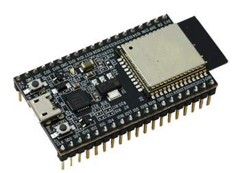
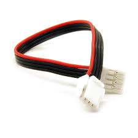
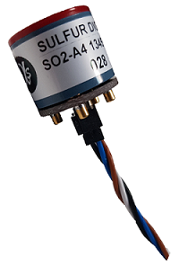
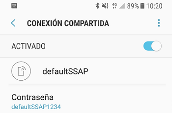

# User&#39;s guide for Smart Spot Starter Kit

## Introduction

In order to offer a simple and intuitive way to get started with our Smart Spot
we have developed an Open Source solution called Smart Spot Starter Kit, which
has an obvious educational purpose. Just by simply obtaining this kit and follow
this guide you will be able to manage the device and to acquire data from its
board sensors, apart from the ones you connect with your smartphone.

To achieve this, we take advantage from technologies like Physical Web. Users
interact via their smartphones thanks to our device that sends &quot;push&quot;
notifications with digital content through Bluetooth without the need to install native 
Apps.

In order to monitorize the air pollution, Smart Spot measures the NO2, CO, SO2
and O3 at specific points in real time. We have a sophisticated high precision
lab, with a Mass Flow Controller and a Zero Air Generator, where through Machine
Learning algorithms we improve the precision of our sensor measures reducing
the effect of cross sensitivity.

For the care and management of data collected by the Smart Spot a maintenance
platform is  needed, our device can be managed remotely by platforms which use
OMA LWM2M as FIWARE. We deploy FIWARE to manage Smart Spot data and also, we
integrate our solution in already existing FIWARE ecosystems.

Optionally, this system provides information about crowds in specific areas,
detecting people with smartphone WiFi switched-on.

## What do you need?

## What is included with The Smart Spot Starter Kit:

1. ESP32 DevKitC.

2. Starter Kit firmware

 	* Physical Web
 	* Crowd Monitoring
 	* LwM2M server
 	* Integration with I2C sensor
 	* GPIO driver

3. Expansion Board:
 	
 	* Temperature, Humidity and Pressure Sensor.
	* Accelerometer and Gyroscope.
	* Luminosity Sensor
	* RGB led
	* GPIO Led

4. Micro USB Cable
5. Smart Spot Air Quality Expansion Board
6. I2C Cable
 

7. 4 x Gas Sensors:
 	* Sulfur Dioxide (Red).
 	* Ozone + Nitrogen Dioxide (Yellow).
 	* Carbon Monoxide (Green).
 	* Nitrogen Dioxide (Orange).

You will need a PC loaded with Windows, Linux or Mac OS with internet connection in order to download the Starter Kit firmware and the ESP32 toolchain and ESP-IDF.

## **Getting Started**

This chapter is a guide for Windows users. In case you use another OS, you can find further information in the following link

[http://esp-idf.readthedocs.io/en/latest/get-started/index.html](http://esp-idf.readthedocs.io/en/latest/get-started/index.html)

1) First, you need to download the ESP32 toolchain by clicking in this link: [https://dl.espressif.com/dl/esp32\_win32\_msys2\_environment\_and\_toolchain-20180110.zip](https://dl.espressif.com/dl/esp32_win32_msys2_environment_and_toolchain-20180110.zip). Unzip it and place somewhere safe. This guide assumes the environment is placed in _C:\ _ .

2) You will also need the ESP32 API. In order to download it, open a terminal, navigate to a directory where you want to place the IDF and use these commands:

~~~

$ git clone --recursive https://github.com/espressif/esp-idf.git

$ git checkout tags/v3.0-rc1

$ git submodule update –init

~~~

Every time you restart your PC you will need to define the IDF\ _PATH by using this command:

~~~

$ export IDF\_PATH=&quot;C:/msys32/home/user-name/esp/esp-idf&quot;

~~~

In case you want to set the path permanently, check out this link:

[http://esp-idf.readthedocs.io/en/latest/get-started/add-idf\_path-to-profile.html#add-idf-path-to-profile-windows](http://esp-idf.readthedocs.io/en/latest/get-started/add-idf_path-to-profile.html#add-idf-path-to-profile-windows)

3) Now is time to download the Smart Sport Firmware. You should open a terminal in another directory and clone our firmware by using the following command:

~~~

$ git clone –-https://github.com/HOP-Ubiquitous/SmartSpot\_SmartSDK\_Firmware.git

~~~
 
4) Once you downloaded everything, open the ESP32 toolchain in order to flash the firmware. Go to the directory where you placed the toolchain and execute the file mingw32.

5) Plug your ESP32 into your PC. Then go to Device Manager and look for its port number (i.e.: COM3).

You may have to download its driver in case you are not able to flash. Download it here.

[https://www.silabs.com/products/development-tools/software/usb-to-uart-bridge-vcp-drivers](https://www.silabs.com/products/development-tools/software/usb-to-uart-bridge-vcp-drivers)

6) Copy the port and the directory of bootloader.bin, smartspot-esp32.bin, and partitions\_singleapp.bin. Replace it by the bolded words of the following command. Use it to flash the esp32.

~~~

$ python /c/Users/HOPU/GitHub/espidf/components/esptool\_py/esptool/esptool.py --chip esp32 --port **COMX** --baud 115200 --before default\_reset --after hard\_reset write\_flash -z --flash\_mode dio --flash\_freq 40m --flash\_size detect 0x1000 **C:/Users/HOPU/GitHub/SmartSpot\_SmartSDK\_Firmware/bootloader.bin** 0x10000

**C:/Users/HOPU/GitHub/SmartSpot\_SmartSDK\_Firmware/smartspot-esp32.bin** 0x8000 **C:/Users/HOPU/GitHub/SmartSpot\_SmartSDK\_Firmware/partitions\_singleapp.bin**

~~~

A message like the one above should appear if you flashed the firmware successfully.

## **Expansion board integration**

This is a detailed list of the expansion board components:

* **Bme280** : This well-known sensor from Bosch measures humidity with ±3% accuracy, barometric pressure with ±1 hPa absolute accuracy, and temperature with ±1.0°C accuracy.  It can be used either with SPI or I2C.

* **Mpu6050** : this sensor contains a MEMS accelerometer and a MEMS gyro in a single chip. It is very accurate, as it contains 16-bits analog to digital conversion hardware for each channel. Therefor it captures the x, y, and z channel at the same time. The sensor uses the I2C-bus interface.

* **Opt3001** : is a sensor that measures the intensity of visible light. The spectral response of the sensor tightly matches the photopic response of the human eye and includes significant infrared rejection.
* **WS2812** : is an intelligent control LED light source that the control circuit and RGB chip are integrated in a package of 5050 components. It internally includes digital port latch and reshaping amplification drive circuit. Each color has a different meaning, representing the current status of the Smart Spot:
  * Purple: Starting software.
  * Blue: Attaching to global connectivity.
  * Orange: Bootstrapping. Connecting to LwM2M servers.
  * Green: Device fully functional.

- **GPIO Led** : is just simply a Led controlled by a GPIO pin of the ESP32. You can manage and switch it on/off from the dashboard.

The expansion board is completely plug and play. If you previously flashed the ESP32 correctly you will only have to plug it in its mark.

# **Gas Sensor Integration**

The idea is to connect the Smart Spot Starter Kit with the gas sensors. Between the available gases, we selected the most important to quantify the air quality (gases required by the OMS), the most interesting depending of the use cases but also interesting gases to carry out corrections in measures:

* NO2: Nitrogen dioxide
* SO2: Sulfur dioxide
* O3: Ozone
* CO: Carbon monoxide

In order to carry out the connection between the expansion board and the Smart Spot Air Quality Expansion Board you only have to plug the i2c cable in both sides. You can use any i2c port you want since they all have the same behavior. Finally, plug the gas sensors in the i2c board.

## **Register your Smart Spot in the IoT Agent**

First, you need to create a WiFi AP with your smartphone for the first connection of the SmartSpot. Once you register in the IoT Agent, you can change the WiFi parameters. This are the default SSID and password:

SSID: **defaultSSAP**

Password: **defaultSSAP1234**

You can easily share the connection with your iOS or Android.

## **Fiware integrations**
FIWARE ([www.fiware.org](http://www.fiware.org)) is an open platform promoted by the European Commision and maintained by the FIWARE Foundation, where HOP Ubiquitous is Gold Member.

FIWARE offers an Open Ecosystem that join different technology enablers for scalable data mangement and make feasible to integrate 
different services and Internet of Things devices into a common and interoperable framework based on Open Standards. In particular,
FIWARE is based on Open Standards such as OMA NGSI for the Services Interface and ETSI ISG CIM for the data models. HOP Ubiquitous 
is an active member and contributor in ETSI ISG CIM and also an active contributor in OMA; being one of pioneer and main companies
working around OMA LwM2M protocol.

In details, FIWARE has a strong role in the Smart Cities market, since the is key to the growth and functionality of Smart Cities, for 
this reason we are committed to initiatives such as Open and Agile Smart Cities (OASC) association with over 100 cities enrolled and 
FIWARE technology as the basis for making it feasible.

Smart Spot is a FIWARE-ready device, it means that Smart Spot has been validated, passed a set of tests, participated in plugfests and 
the most important is supporting the APIs, FIWARE data models based on ETSI ISG CIM and it is fully interoperable and integrated with
key components from FIWARE such as Orion Context Broker.

In details, Orion Context Broker is the core of FIWARE platform; since it enables the common integration of heterogenous data sources 
into a common component, which enables the capacity to carry out advanced queries, cross data among heterogenous domains (e.g., noise
with crowd, weather and mobility, etc.), and finally it can exports data to several data analytics components such as Hadoop / COSMOS 
(Big Data), SHT (Time Series), CKAN (Open Data), MongoDB (Non-structured data), etc.

FIWARE and the solutions from HOP Ubiquitous are contributing to the creation of adapted and standardized solutions to satisfy the 
described process from the cocreation and citizens engagement to the deployment of solutions based on IoT to reach the digitalization 
and enhancement of different areas in the city.

Thanks to the LwM2M Bootstrap Server deployed and integrated in the Homard platform, it is really easy to setup the server configuration 
for a the device. In this way, anyone can deploy its own LwM2M IOTAgent with a public server IP and configure the device to integrate it 
in FIWARE.

A tutorial about Orion Context Broker has been developed by FIWARE and HOP Ubiquitous, which can be downloaded in: [tutorial](http://goo.gl/o1KXcT)
